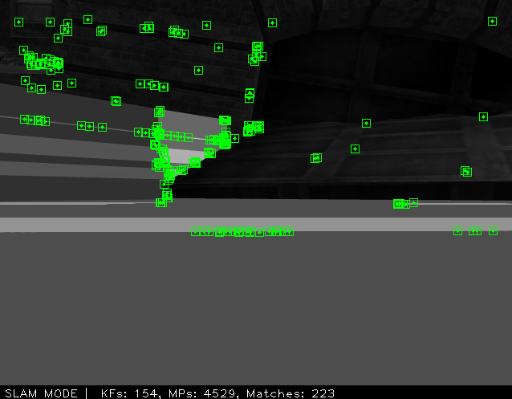
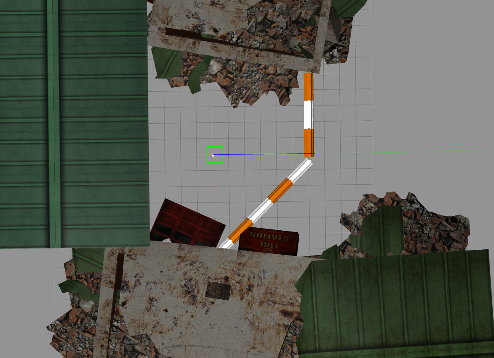

# myorbslamwithros
这个东西主要是用来完整的感受一下gazebo中跑slam框架的感觉
运行方法
```bash
roslaunch myorbslamwithros simple_gazebo.launch #启动gazebo
```
在新的终端里面
```bash
rosrun teleop_twist_keyboard teleop_twist_keyboard.py #控制车跑来跑去
```
如果找不到这个的话记得apt安装一下
```bash
sudo apt-get install ros-kinetic-teleop-twist-keyboard 
```
剩下的部分就是orb_slam2那边的东西了，照着github基本可以运行起来了，具体看[这里](note/note5_all.md)
比较麻烦的是配置文件这里我直接配置好了
```yaml
%YAML:1.0

#--------------------------------------------------------------------------------------------
# Camera Parameters. Adjust them!
#--------------------------------------------------------------------------------------------

# Camera calibration and distortion parameters (OpenCV) 
Camera.fx: 554.254691
Camera.fy: 554.254691
Camera.cx: 320.5
Camera.cy: 240.5

Camera.k1: 0.00000001
Camera.k2: 0.00000001
Camera.p1: 0.00000001
Camera.p2: 0.00000001
Camera.k3: 0.00000001

Camera.width: 640
Camera.height: 480

# Camera frames per second 
Camera.fps: 20.0

# IR projector baseline times fx (aprox.)
Camera.bf: 40.0

# Color order of the images (0: BGR, 1: RGB. It is ignored if images are grayscale)
Camera.RGB: 1

# Close/Far threshold. Baseline times.
ThDepth: 40.0

# Deptmap values factor 
DepthMapFactor: 1.0

#--------------------------------------------------------------------------------------------
# ORB Parameters
#--------------------------------------------------------------------------------------------

# ORB Extractor: Number of features per image
ORBextractor.nFeatures: 1000

# ORB Extractor: Scale factor between levels in the scale pyramid 	
ORBextractor.scaleFactor: 1.2

# ORB Extractor: Number of levels in the scale pyramid	
ORBextractor.nLevels: 8

# ORB Extractor: Fast threshold
# Image is divided in a grid. At each cell FAST are extracted imposing a minimum response.
# Firstly we impose iniThFAST. If no corners are detected we impose a lower value minThFAST
# You can lower these values if your images have low contrast			
ORBextractor.iniThFAST: 20
ORBextractor.minThFAST: 7

#--------------------------------------------------------------------------------------------
# Viewer Parameters
#--------------------------------------------------------------------------------------------
Viewer.KeyFrameSize: 0.05
Viewer.KeyFrameLineWidth: 1
Viewer.GraphLineWidth: 0.9
Viewer.PointSize:2
Viewer.CameraSize: 0.08
Viewer.CameraLineWidth: 3
Viewer.ViewpointX: 0
Viewer.ViewpointY: -0.7
Viewer.ViewpointZ: -1.8
Viewer.ViewpointF: 500

```

运行效果


