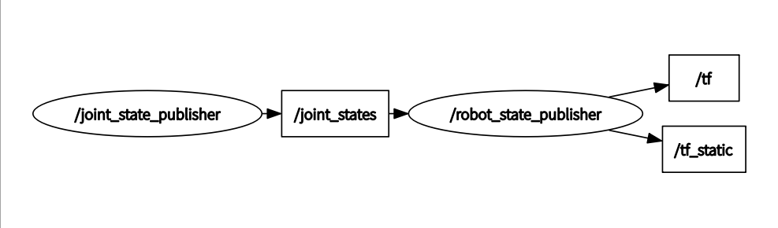

### 介绍一下两个包
#### [joint_state_publisher](http://wiki.ros.org/joint_state_publisher)
```XML
<node name="joint_state_publisher" pkg="joint_state_publisher" type="joint_state_publisher" />
```
这个包就是用来将urdf的各个关节的值给发送出来和调试用的(提供ui），具体就是读取参数服务器上的robot_description,然后解析这个文件，读取里面所有非fixed的关节，然后计算出每个关节的值，通过topic(sensor_msgs/JointState)发送出去，注意这个是一个topic不是tf
```bash
rosmsg info sensor_msgs/JointState 
std_msgs/Header header
  uint32 seq
  time stamp
  string frame_id
string[] name
float64[] position
float64[] velocity
float64[] effort
```
#### [robot_state_publisher](http://wiki.ros.org/robot_state_publisher)
```xml
<node name="robot_state_publisher" pkg="robot_state_publisher" type="state_publisher" />
```
这个包是用来计算各个关节对应的tf的。具体就是先读取参数服务器上的robot_description，然后解析出各个关节之间的关系，然后根据订阅的话题joint_states,通过正运动学计算出每个link对应的位姿，然后发布出tf。

#### 总结
如果只是要调试和可视化urdf文件，只要这两个包放在一起用即可了。


然后rviz可以看到模型的各个link好像是自己读取参数服务器的，不是通过订阅话题的。
