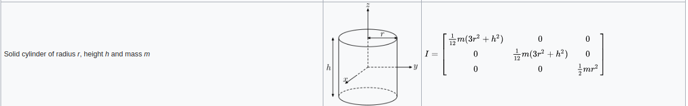
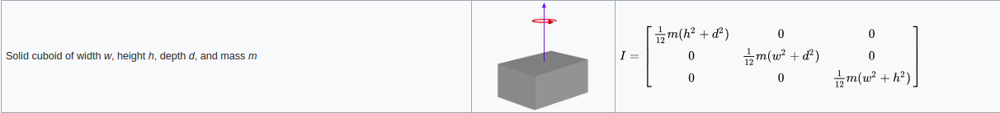

### [详细学习urdf就点我](http://wiki.ros.org/urdf/XML)
urdf主要有1个标签< robot>,然后< robot>标签主要包含了四个标签
* link
* joint
* gazebo
* transmission
### robot
主要描述了一个完整的机器人，所有的标签都必须是它的子标签，只有一个属性name，用来制定机器人的名字
***
### link
描述了一个机器人的某个部分（我是这样理解的，可以视为刚体的某个部分）,例如手臂、身体、轮子等。

有一个属性name：用来描述link的名字
有三个子标签
* visual:用来描述link的外观
* collision:用来描述link的碰撞属性
* inertial:用来描述link的物理属性
>visual:
>* origin: 描述link外观的姿态，旋转和平移
>* geometry: 描述link的形状
>* material：外形的一些附加东西，例如color

>collision:
>* origin: 和visual一样
>* geometry:和visual一样

>inertial:
>* origin:link的重心
>* mass:link的质量，单位kg
>* inertia: 一些跟惯性相关的东西，不太懂物理。大概跟大物里面的旋转惯量有一定的关系，是一个9*9的对称矩阵，所以只有6个不一样的属性,ixx,ixy,ixz,iyy,iyz,izz。对于规则的物体，有公式可以计算，对于不规则的物体好像有软件可以计算[list of moment of inertia tensors](https://en.wikipedia.org/wiki/List_of_moments_of_inertia#List_of_3D_inertia_tensors)(维基百科，可能需要翻墙才能访问），例如meshlab，不过我也没用过。
>sphere
>cylinder
>box
***
### joint
描述了两个link之间的运动学和动力学关系,同时还有安全限制(范围限制)

### 有两个属性
>* name:描述joint的名字
>* type:描述joint的类型。

|type|描述|
|---|---|
|revolute|绕一个轴旋转，带有limited,需要制定upper和lower|
|continuous|绕一个轴旋转，没有limited|
|prismatic|沿着一个轴滑动，带有limited|
|fixed|没有自由度|
|floating|6自由度|
|planar|一个平面|

**后两个类型没用过，不太了解**
### 有很多子标签，常用的几个介绍下
>* origin:子link相对于父link的姿态
>* parent: 父link
>* child: 子link
>* axis: 旋转或者平移的轴的方向或者其他，根type的类型有关系
>* dynamics: 动力学相关的书信，damping和friction
>* others:更多的就直接看文档吧，用的比较少，不太懂[官方点我](http://wiki.ros.org/urdf/XML/joint)
***

以上两个主要看[vechile.xacro](../urdf/vechile.xacro)即可，基本上都是一些模板化的东西，也是比较常见和好理解的。
***
### [transmission](http://gazebosim.org/tutorials/?tut=ros_control)
属于拓展标签，这个主要跟ros_control有关系。
***
### [详细理解gazebo标签点我](http://gazebosim.org/tutorials/?tut=ros_urdf)
这个东西是个拓展的标签，主要是用在gazebo中的。urdf有些属性在gazebo中是无效的，需要由这个标签来补充，以及一些跟gazebo相关的东西也要由这个标签来实现。例如color和插件.

gazebo标签可以作用在三个类型
* robot
* link
* joint

### xacro
当然上面这些东西同样适用于xacro，xacro可以有效的组织urdf，通过一个脚本即可把xacro转换为urdf。

这个是直接存储到rosparam上的
```XML
<param name="robot_description" command="$(find xacro)/xacro.py $(arg model)" />
```

