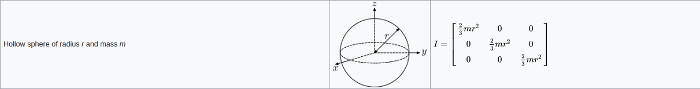
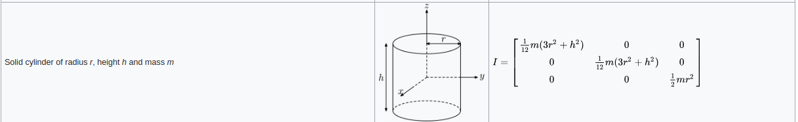
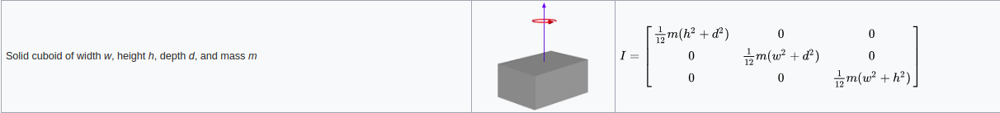

### 目标
在gazebo中跑orb_slam2这个slam框架。
### 步骤
>orb_slam2是一个完成度比较高的项目，基本可以当作库来使用了，正常使用来说，orb_slam2提供的接口都是要通过opencv::Mat这个格式的imgae作为input，一般使用的话，是先驱动camera（由于我跑的是orb_slam2的depth模式，接下来所有的camera都是指depth camera），然后通过串口或者某种方式得到数据流，然后转化成Mat格式，然后调用orb_slam2的接口传入数据，然后库便会返回位姿（在ros里面叫做tf)。这篇文章主要是介绍如何在仿真里面跑slam框架，所以对具体的slam算法和步骤不做介绍。

然而现在问题是，我们并没有具体的环境和硬件，我们是想要在电脑上完成这一切，也就是仿真，由于我只用过gazebo和ros，所以我选择用gazebo来仿真环境，获得我们所需要的一切数据，通过ros系统提供的接口来接收和解析数据。既然选择用gazebo来获取一切所需要的数据，那么便要在gazebo中完成一切现实中的任务，即找到一个合适的场景（纹理要多），一台深度摄像机，一台可以移动的机器人，一个可以控制机器人的方法。

综上所述，我们把任务分解为以下两个部分
1. 创建一个机器人
2. 控制该机器人移动，并且在该机器人身上搭建camera
3. 将camer的数据传入orb_slam系统

由于步骤比较多，涉及到的内容也比较分散，我分为3篇文章来写，这是第一篇文章。
### 一. 创建机器人（URDF）
ros里面的机器人比较常用的方式是采用urdf文件来描述，urdf采用的是XML的语法。具体的资料，roswiki上还是有的，不过看得比较头疼就是了，下面列举了一些比较常用的部分。
### [详细学习urdf就点我](http://wiki.ros.org/urdf/XML)
urdf主要有1个标签< robot>,然后< robot>标签主要包含了四个标签
* link
* joint
* gazebo
* transmission
### robot
主要描述了一个完整的机器人，所有的标签都必须是它的子标签，只有一个属性name，用来制定机器人的名字
***
### link
描述了一个机器人的某个部分（我是这样理解的，可以视为刚体的某个部分）,例如手臂、身体、轮子等。

有一个属性name：用来描述link的名字
有三个子标签
* visual:用来描述link的外观
* collision:用来描述link的碰撞属性
* inertial:用来描述link的物理属性
>visual:
>* origin: 描述link外观的姿态，旋转和平移
>* geometry: 描述link的形状
>* material：外形的一些附加东西，例如color

>collision:
>* origin: 和visual一样
>* geometry:和visual一样

>inertial:
>* origin:link的重心
>* mass:link的质量，单位kg
>* inertia: 一些跟惯性相关的东西，不太懂物理。大概跟大物里面的旋转惯量有一定的关系，是一个9*9的对称矩阵，所以只有6个不一样的属性,ixx,ixy,ixz,iyy,iyz,izz。对于规则的物体，有公式可以计算，对于不规则的物体好像有软件可以计算[list of moment of inertia tensors](https://en.wikipedia.org/wiki/List_of_moments_of_inertia#List_of_3D_inertia_tensors)(维基百科，可能需要翻墙才能访问），例如meshlab，不过我也没用过。
>sphere
>cylinder
>box
***
### joint
描述了两个link之间的运动学和动力学关系,同时还有安全限制(范围限制)

### 有两个属性
>* name:描述joint的名字
>* type:描述joint的类型。

|type|描述|
|---|---|
|revolute|绕一个轴旋转，带有limited,需要制定upper和lower|
|continuous|绕一个轴旋转，没有limited|
|prismatic|沿着一个轴滑动，带有limited|
|fixed|没有自由度|
|floating|6自由度|
|planar|一个平面|

**后两个类型没用过，不太了解**
### 有很多子标签，常用的几个介绍下
>* origin:子link相对于父link的姿态
>* parent: 父link
>* child: 子link
>* axis: 旋转或者平移的轴的方向或者其他，根type的类型有关系
>* dynamics: 动力学相关的书信，damping和friction
>* others:更多的就直接看文档吧，用的比较少，不太懂[官方点我](http://wiki.ros.org/urdf/XML/joint)
***

以上两个基本上都是一些模板化的东西，也是比较常见和好理解的。
***
### [transmission](http://gazebosim.org/tutorials/?tut=ros_control)
属于拓展标签，这个主要跟ros_control有关系。ros_control跟这里的关系不是很大，就不介绍了。
***
### [详细理解gazebo标签点我](http://gazebosim.org/tutorials/?tut=ros_urdf)
这个东西是个拓展的标签，主要是用在gazebo中的。urdf有些属性在gazebo中是无效的，需要由这个标签来补充，以及一些跟gazebo相关的东西也要由这个标签来实现。例如color和插件.

gazebo标签可以作用在三个类型
* robot
* link
* joint

### xacro
当然上面这些东西同样适用于xacro，xacro可以有效的组织urdf，通过一个脚本即可把xacro转换为urdf。

这个是直接存储到rosparam上的
```XML
<param name="robot_description" command="$(find xacro)/xacro.py $(arg model)" />
```

最终的机器人大概长这个样子
```XML
<?xml version="1.0"?>
<robot xmlns:xacro="http://www.ros.org/wiki/xacro" name="vechile">
<xacro:property name="body_x" value="0.2" />
<xacro:property name="body_y" value="0.1" />
<xacro:property name="body_z" value="0.05" />
<xacro:property name="wheel_r" value="0.025" />
<xacro:property name="wheel_l" value="0.025" />
<xacro:property name="body_mass" value="0.5" />
<xacro:property name="wheel_mass" value="0.05" />
<xacro:property name="pi" value="3.1415926"/>
<xacro:property name="camera_a" value="0.05"/>
<xacro:property name="camera_mass" value="0.05" />
<xacro:property name="camera_name" value="camera" />

<material name="black">
    <color rgba="0 0 0 1"/>
</material>

<material name="white">
    <color rgba="1 1 1 1"/>
</material>
<link name="base_link">
    <visual>
        <geometry>
            <box size="${body_x} ${body_y} ${body_z}"/>
        </geometry>
        <material name="white"/>
        <origin xyz="0 0 ${body_z/2}"/>
    </visual>
    <collision>
        <geometry>
            <box size="${body_x} ${body_y} ${body_z}"/>
        </geometry>
        <origin xyz="0 0 ${body_z/2}"/>
    </collision>
    <inertial>
        <mass value="${body_mass}" />
        <inertia ixx="${body_mass/12*(body_y*body_y+body_z*body_z)}"
        iyy="${body_mass/12*(body_x*body_x+body_z*body_z)}"
        izz="${body_mass/12*(body_y*body_y+body_x*body_x)}" 
        ixy="0.0" ixz="0.0" iyz="0.0"/>
    </inertial>
</link>
<xacro:macro name="wheel" params="prefix">
    <link name="${prefix}_wheel">
        <visual>
            <geometry>
                <cylinder length="${wheel_l}" radius="${wheel_r}"/>
            </geometry>
            <material name="black"/>
            <origin xyz="0 0 0" rpy="${pi/2} 0 0" />
        </visual>
        <collision>
            <geometry>
                <cylinder length="${wheel_l}" radius="${wheel_r}"/>
            </geometry>
            <origin xyz="0 0 0" rpy="${pi/2} 0 0" />
        </collision>
        <inertial>
            <mass value="${wheel_mass}" />
            <inertia ixx="${wheel_mass/12*(3*wheel_r*wheel_r+wheel_l*wheel_l)}" 
            iyy="${wheel_mass/12*(3*wheel_r*wheel_r+wheel_l*wheel_l)}"
            izz="${wheel_mass/2*(wheel_r*wheel_r)}" 
            ixy="0.0" ixz="0.0" iyz="0.0"/>
        </inertial>
    </link>
    <transmission name="${prefix}_wheel_trans">
        <type>transmission_interface/SimpleTransmission</type>
        <actuator name="${prefix}_wheel_motor">
            <mechanicalReduction>1</mechanicalReduction>
        </actuator>
        <joint name="${prefix}_wheel_to_base">
            <hardwareInterface>VelocityJointInterface</hardwareInterface>
        </joint>
    </transmission>
    <gazebo reference="${prefix}_wheel">
      <mu1 value="200.0"/>
      <mu2 value="100.0"/>
      <kp value="10000000.0" />
      <kd value="1.0" />
      <material>Gazebo/Grey</material>
    </gazebo>


</xacro:macro>

<xacro:wheel prefix="left_front" />
<xacro:wheel prefix="left_rear" />
<xacro:wheel prefix="right_front" />
<xacro:wheel prefix="right_rear" />

<joint name="left_front_wheel_to_base" type="continuous">
    <parent link="base_link"/>
    <child link="left_front_wheel"/>
    <origin xyz="${body_x/4} ${body_y/2+wheel_l/2} 0" />
    <axis xyz="0 1 0"/>
</joint>
<joint name="left_rear_wheel_to_base" type="continuous">
    <parent link="base_link"/>
    <child link="left_rear_wheel"/>
    <origin xyz="${-body_x/4} ${body_y/2+wheel_l/2} 0"/>
    <axis xyz="0 1 0"/>
</joint>
<joint name="right_front_wheel_to_base" type="continuous">
    <parent link="base_link"/>
    <child link="right_front_wheel"/>
    <origin xyz="${body_x/4} ${-body_y/2-wheel_l/2} 0"/>
    <axis xyz="0 1 0"/>
</joint>
<joint name="right_rear_wheel_to_base" type="continuous">
    <parent link="base_link"/>
    <child link="right_rear_wheel"/>
    <origin xyz="${-body_x/4} ${-body_y/2-wheel_l/2} 0"/>
    <axis xyz="0 1 0"/>
</joint>
<link name="camera">
    <visual>
        <geometry>
            <box size="${camera_a} ${camera_a} ${camera_a}"/>
        </geometry>
        <material name="black"/>
        <origin xyz="0 0 ${camera_a/2}"/>
    </visual>
    <collision>
        <geometry>
            <box size="${camera_a} ${camera_a} ${camera_a}"/>
        </geometry>
        <origin xyz="0 0 ${camera_a/2}"/>
    </collision>
    <inertial>
        <mass value="${camera_mass}" />
        <inertia 
        ixx="${camera_mass/12*(camera_a*camera_a+camera_a*camera_a)}"
        iyy="${camera_mass/12*(camera_a*camera_a+camera_a*camera_a)}"
        izz="${camera_mass/12*(camera_a*camera_a+camera_a*camera_a)}" 
        ixy="0.0" ixz="0.0" iyz="0.0"/>
    </inertial>
</link>
<joint name="camera_base" type="fixed">
    <parent link="base_link"/>
    <child link="camera"/>
    <origin xyz="${body_x/4} 0 ${body_z}"/>
</joint>    
    <gazebo reference="camera">
      <material>Gazebo/Grey</material>
    </gazebo>

```
可以通过rviz查看，launch文件如下
```XML
<launch>
    <arg name="model" 
    default="$(find myorbslamwithros)/urdf/vechile.xacro"/>
    <arg name="gui" default="true" />
    <param name="robot_description" command="$(find xacro)/xacro.py $(arg model)" />
    <param name="use_gui" value="$(arg gui)"/>

    <node name="joint_state_publisher" pkg="joint_state_publisher" type="joint_state_publisher" />
    <node name="robot_state_publisher" pkg="robot_state_publisher" type="state_publisher" />
    <node name="rviz" pkg="rviz" type="rviz" />

</launch>
```

上面的model的值记得换成你的模型文件所在的路径.运行效果如下


记得改fixedFrame和添加robotmodel。
### 介绍一下launch文件中用到的两个包
#### [joint_state_publisher](http://wiki.ros.org/joint_state_publisher)
```XML
<node name="joint_state_publisher" pkg="joint_state_publisher" type="joint_state_publisher" />
```
这个包就是用来将urdf的各个关节的值给发送出来和调试用的(提供ui），具体就是读取参数服务器上的robot_description,然后解析这个文件，读取里面所有非fixed的关节，然后计算出每个关节的值，通过topic(sensor_msgs/JointState)发送出去，注意这个是一个topic不是tf
```bash
rosmsg info sensor_msgs/JointState 
std_msgs/Header header
  uint32 seq
  time stamp
  string frame_id
string[] name
float64[] position
float64[] velocity
float64[] effort
```
#### [robot_state_publisher](http://wiki.ros.org/robot_state_publisher)
```xml
<node name="robot_state_publisher" pkg="robot_state_publisher" type="state_publisher" />
```
这个包是用来计算各个关节对应的tf的。具体就是先读取参数服务器上的robot_description，然后解析出各个关节之间的关系，然后根据订阅的话题joint_states,通过正运动学计算出每个link对应的位姿，然后发布出tf。

#### 总结
如果只是要调试和可视化urdf文件，只要这两个包放在一起用即可了。


然后rviz可以看到模型的各个link好像是自己读取参数服务器的，不是通过订阅话题的。
